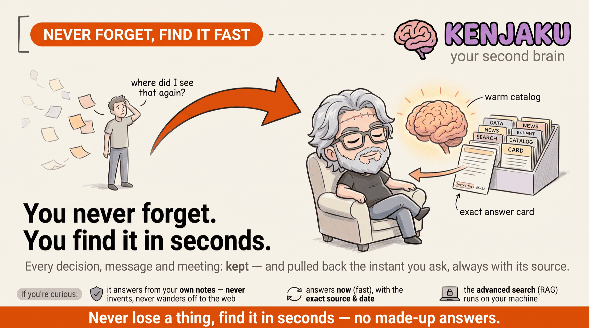
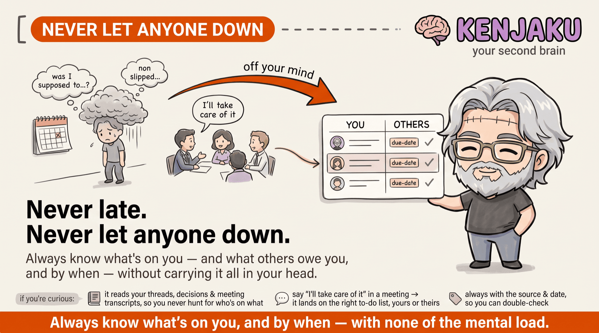
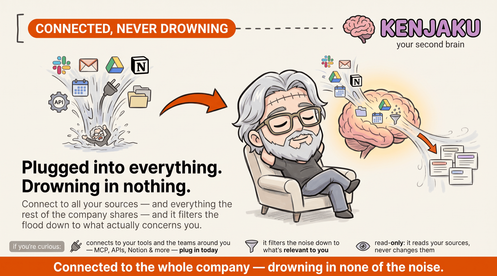
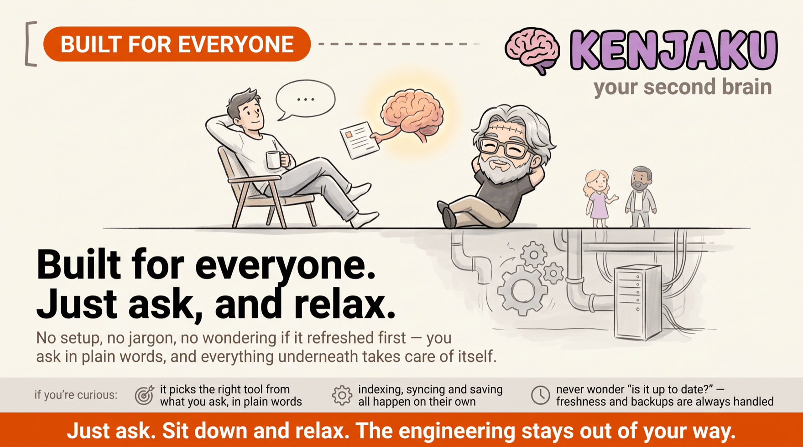
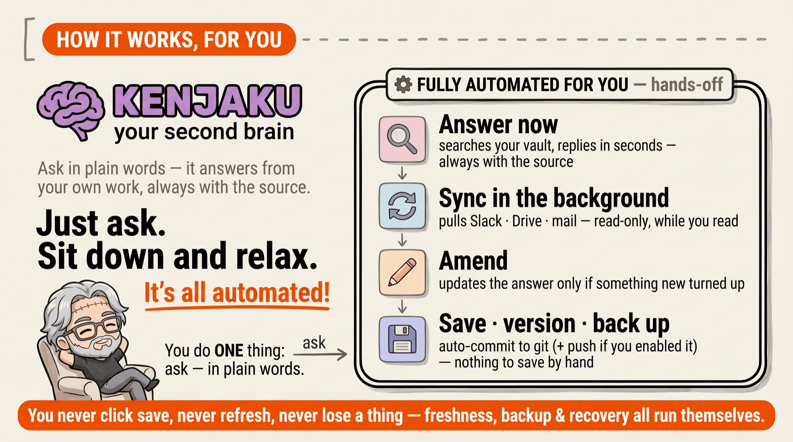
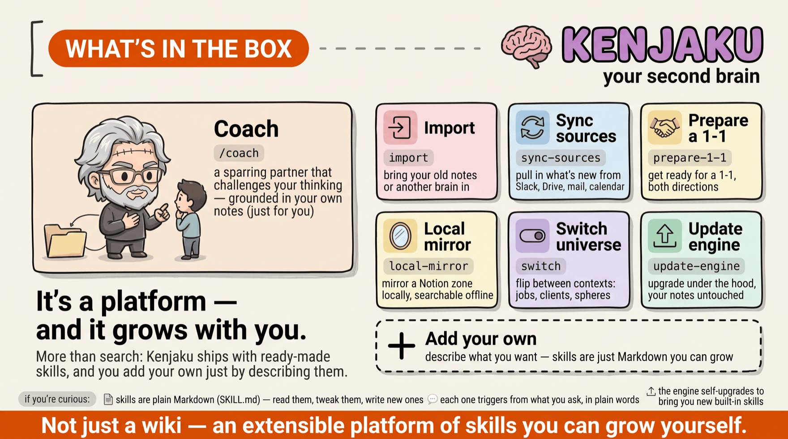
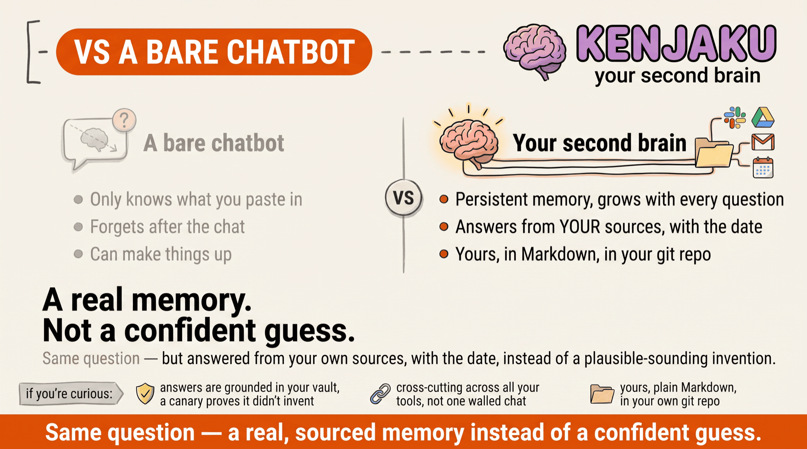
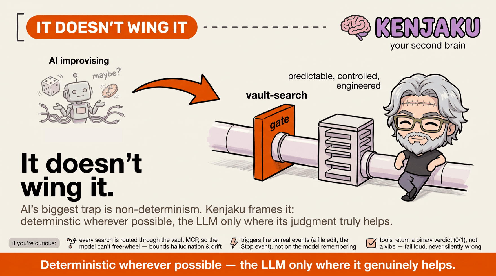
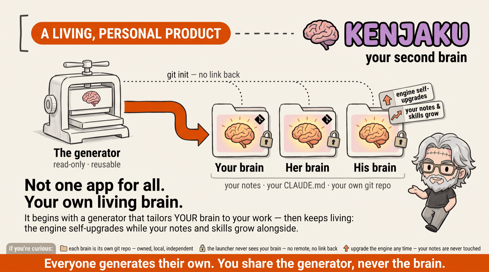

# Kenjaku — your second brain &nbsp;

## Never miss what matters — and never drown in the rest.

### 🧠 *Just ask. Sit down and relax.* &nbsp;<sub>*— your second brain handles the rest.*</sub>

*By Thomas Pierrain (VP Tech at [shodo](https://shodo.io/))*

> **Kenjaku is a Karpathy-style LLM wiki, reinforced where it counts with battle-tested software.**

[](https://github.com/tpierrain/kenjaku/releases/latest)
&nbsp;[](#privacy-à-la-carte--you-decide-who-touches-your-data)
&nbsp;[](#-install-your-brain-in-one-paste)
&nbsp;[](#keeping-your-brain-fresh--universes--engine-updates--importing-an-old-brain)
&nbsp;[](https://github.com/tpierrain/kenjaku/tree/main/maintainers/mutation)


**Ask it like you'd ask a personal assistant — no dev skills required — and pull up any decision or
piece of info from your work in seconds, always with the sources.** *In Claude Desktop or on the
command line, your call.*

**[🧠 What's a second brain?](#what-is-a-second-brain) · [🚀 Install yours now](#-install-your-brain-in-one-paste) · [📖 View the articles](#the-article-series)**

> 🧑 *"Where are we on the billing project — who owns what, and what's been decided?"*
>
> 🧠 *"At the January 15 team sync: the database was settled (PostgreSQL over MongoDB),
> and Jane Doe — platform Tech Lead — is pushing to get ahead of technical debt as early
> as sprint 1.*
> *→ decision of January 10 · → team sync of January 15"*

> 🧑 *"What does 'MEDDIC' mean — that thing the sales team keeps repeating in their meetings?"*
>
> 🧠 *"MEDDIC = the opportunity-qualification method adopted by sales: Metrics, Economic
> buyer, Decision criteria, Decision process, Identify pain, Champion. Introduced by John Smith (VP
> Sales) at the sales kickoff on February 12 to make the forecast more reliable.*
> *→ sales kickoff of February 12 · → sales playbook"*

---

<a id="what-is-a-second-brain"></a>

## Why you need it

> *"Wait — you hadn't heard?"* · *"That was decided last week."* · *"You didn't see Sarah's email?"* ·
> *"It's in the #product Slack thread…"*

We've all been on the receiving end of that — **behind**, never having had the chance to catch up, to
read it all, to digest it all. The faster the world moves, the more sources you plug into (Slack, mail,
Drive, meeting transcripts, your own notes) and the more the signal drowns in the noise. Staying on top
of it is a second full-time job — **unless your memory does it for you.**

---

## What it does for you — *never forget · never let anyone down · never drown*

The whole point, in three everyday aches it takes off your plate. No jargon — the mechanics live in the
small *"if you're curious:"* strip on each board.



*🧠 **Never forget** — the decision made last quarter, the message you know you saw somewhere: pulled back
in seconds, always with its source. From **your own notes**; never invented, never off to the web.*



*✅ **Never let anyone down** — live with a customer, or juggling ten threads: know at a glance what's on
**you** and what **others** owe you, and by when. A spoken *"I'll take care of it"* lands on the right
to-do list by itself.*



*🌊 **Never drown** — back from a week off, or freshly wired into the CRM and call transcripts: instead of
drowning in the flood, ask, and it **filters** it down to what concerns *you*, with the source and the
date. Read-only: it reads your sources, never changes them.*

> **Whoever you are** — Head of Engineering, PM, Customer Success, sales, consultant, researcher — it
> keeps *your* thread: your teams and 1-1s, the *why* behind a product decision, a client's whole context.

> **All-audience by design — that's the whole point.** It was **conceived so non-tech profiles can use
> it**: use-case-driven, nothing to manage, and **no temporal coupling** to track (never a *"did it
> refresh before I asked?"* — freshness, backup and recovery are all handled). If you can *chat* with
> Claude, you can use it. **Just ask. Sit down and relax.** *(Only the one-time install is technical,
> and it's guided end-to-end.)*



---

## How a question flows — answer now, verify in the background



The web's **stale-while-revalidate** pattern, applied to your memory: you get a **fast** answer from
what's already indexed; freshness catches up **behind the scenes** and only **amends** the answer if
there's genuinely something new. *([details in EN-QUOI §2](EN-QUOI-C-EST-DIFFERENT.md#2-how-it-works-answer-right-away-verify-afterwards))*

> 💾 **Nothing to save, nothing to lose.** Every change is **auto-committed to your git repo** the
> instant it's written — and whatever you typed straight into Obsidian, outside your brain, is swept
> in at its next start. No *"did I save that?"*, ever. Connect a **remote** (optional, one setting) and
> it **auto-pushes** there too, so a **lost, stolen or dead laptop costs you nothing** — restore your
> whole brain on a new machine from the backup.

---

## What it is — and what it is *not*

| ✅ What it **is** | ⛔ What it is **not** |
|---|---|
| **Yours**, in an open format (Markdown + `[[wikilinks]]`, Obsidian-compatible, your git repo) | **Not "100% private" end-to-end** — the **search** is local by default, but the LLM that **reasons** is still Claude (cloud) |
| **Grounded** — answers cite their sources, with dates; a canary **proves** it queried your vault | **Not zero-install** — daily *use* needs no skill, but the one-time setup (~15 min) assumes git + Node |
| **Cross-cutting** — Slack + Drive + mail + transcripts + your notes, in one place | **Not (yet) multi-AI** — Claude-only for the driving layer (vault + engine stay agnostic) |
| **Zero-chore** — backup, indexing, freshness, recovery, engine updates run on their own | **Not a synced fleet** — each generated brain is self-sufficient and evolves locally |

*Honesty is part of the approach — the full owned-up limitations are in
[EN-QUOI §7](EN-QUOI-C-EST-DIFFERENT.md#7-what-it-is-not-the-owned-up-limitations).*

---

## 🧠 Why “Kenjaku”?

**Kenjaku** is the brain-swapping schemer of [*Jujutsu Kaisen*](https://jujutsu-kaisen.fandom.com/wiki/Kenjaku): a body-hopping antagonist who grafts himself onto a new host and carries on. A wink at what a second brain does: you graft it on, and you get to keep it.

---

## More than search — an extensible platform of skills



Kenjaku isn't just a search box: it ships ready-made **skills** — a `/coach` that plays a fierce
sparring partner to challenge your thinking (grounded in **your own** notes), **self-healing
wiki-health** skills that keep your notes tidy (`/lint`, `/consolidate`, `/file-back` spot decayed
links, duplicates and unfiled captures, then **propose** fixes you confirm), plus `import`,
`sync-sources`, `prepare-1-1`, `local-mirror`, `switch` and `update-engine` — and, above all, **you add
your own just by describing them**. Skills are plain Markdown you can read, tweak and grow. The ones you
leave alone **keep improving with each engine update**; the ones you tailor become yours and are never
overwritten. *Not just a wiki — a platform.*

---

## How it compares — at a glance

Two reference points people reach for: a **bare LLM** and a **Karpathy-style LLM wiki**, each with its
own board below, then a **side-by-side matrix** with Kenjaku. *(How it stacks up against the classic
second-brain **apps**, and why installing one doesn't lock you into this repo, is [further
down](#your-brain-isnt-tied-to-this-repo) in the technical part.)*

### vs a bare LLM (ChatGPT / Claude alone)



*A bare chatbot only knows what you paste and forgets after the chat — your brain **remembers**, and
answers from **your** sources, with the date.*

### vs a plain LLM wiki (à la Karpathy) — kept, and grown up


In short: **Kenjaku is a Karpathy-style LLM wiki, reinforced where it counts with battle-tested
software.** It keeps the wiki (an LLM turns your sources into an interlinked Markdown wiki), and adds the
layer a hand-built one lacks: **deterministic software** that makes it **more reliable** and takes the
work off your hands, so all you do is **ask** (the **affordance**).

> 🧬 *A **credited evolution**, a **superset** — not an opposition, and never a priority claim.
> ([ADR 0033](maintainers/decisions/0033-descends-from-karpathy-llm-wiki-not-graphify.md))*

### Side by side

| | Bare LLM | Karpathy's LLM wiki | **Kenjaku** |
|---|---|---|---|
| **Memory** | Only what you paste; gone after the chat | Files you point an agent at | **Persistent — grows with every question** |
| **Grounding** | Can invent | Your files, searched by hand | **Your notes, with source + date** |
| **Scope** | A single chat | Your wiki files | **Cross-cutting across all your tools** |
| **Ownership** | Hosted, ephemeral | Yours (Markdown) | **Yours — Markdown, your git repo** |
| **Freshness & upkeep** | — | Hand-wired, manual | **Deterministic, self-healing, hands-off** |
| **Reliability** | — | DIY, fragile | **Battle-tested · green-only tests · grounding proven** |

---

<a id="and-the-privacy-of-my-data"></a>
<a id="how-do-i-choose-my-semantic-search-my-rag"></a>

## Privacy, à la carte — *you* decide who touches your data


This choice is about **one thing only**: the **advanced-search (RAG) engine** — the *embedder* that
turns your notes into vectors so they can be searched by meaning. You **pick 1 of 3** implementations
at install. (The AI that *reasons and answers* is always **Claude** — see the note below.) Most tools
**impose** that engine on you; here it's an **interchangeable adapter** you choose — without breaking
your notes or skills.

| Option | Privacy | For whom | Engine |
|---|---|---|---|
| 🟢 **On your machine** *(recommended ≥ 12 GB RAM, not Intel Mac)* | **Nothing leaves** · free · offline | Non-dev, nothing to install | **EmbeddingGemma**, on-device (ONNX) |
| 🟡 **With an API key** | Your notes' text goes to the provider you pick | Small machine / Intel Mac | **Gemini** / OpenAI / Mistral / **your company endpoint** |
| 🟢 **Local via Ollama** *(advanced)* | **Nothing leaves** either | Comfortable installing an app | Any Ollama model (e.g. `bge-m3`) |

> 🧠 **The embedder is *not* "ChatGPT on your machine".** It's a tiny vectorization model; the AI that
> **reasons and answers is still Claude**. Changing option re-encodes in a few minutes — no note lost.
> *(training-controls & pricing detail: [SETUP §9](SETUP.md#9-data-privacy) · the “à la carte RAG”:
> [EN-QUOI §6](EN-QUOI-C-EST-DIFFERENT.md#6-the-à-la-carte-rag-you-pick-your-engine-according-to-your-constraints))*

---

<a id="ready-to-try-it"></a>

## 🚀 Install your brain in one paste

**Your only hands-on move:** open Claude and paste this one sentence (adapt the name & URL).

```text
Install me a second brain named "second-brain" (name to be confirmed) from this generator: https://github.com/tpierrain/kenjaku
```

Claude does everything else: clones the launcher, asks you a few questions **in chat** (name, location,
your language, and the one privacy choice), runs the installer, **builds your brain and proves it works**
— or **stops dead and tells you why**. Never a ghost install.

**📦 What you need** — [Claude Code](https://claude.com/claude-code), **[Node.js](https://nodejs.org) ≥ 20**
and **git**. The installer checks each one and tells you cleanly if something's missing.
*(Only if you pick the API-key option: an [API key](https://aistudio.google.com/apikey) — pasted into
`.env`, never in chat. See [privacy](#privacy-à-la-carte--you-decide-who-touches-your-data).)*

> ⚠️ **The #1 Desktop trap — open your brain in a *brand-new* conversation.** Your brain only works if
> the conversation is rooted in **its folder**. On the Claude Desktop **Code tab**, open a **New
> session**, then **click the FOLDER CHIP** at the bottom (just above the input field) and pick your
> brain — **not** the `➕` “Add another folder” button (that adds without replacing the root, and the
> brain won't load). On the CLI it's foolproof: `cd ~/second-brain && claude`.

 

*Full walk-through — the 3 moves, launcher-vs-brain diagram, key-in-`.env`, remote backup — in
[SETUP](SETUP.md#2-installation).*

---

<a id="keeping-your-brain-up-to-date-its-engine"></a>
<a id="one-brain-several-universes-optional"></a>

## Keeping your brain fresh — universes · engine updates · importing an old brain

- **🌌 One brain, several universes (optional).** Life comes in chapters — a past employer then a new
  one, several clients, work and personal. A **universe** is a soft scope: working inside one, your
  brain answers from *that* universe's notes (plus the handful you keep cross-cutting). It stays
  **invisible until you create a second one**. A plain *"switch to my Acme universe"* changes the scope,
  and *"rename it to Acme Corp"* renames it everywhere — folder, notes, Obsidian and all — after telling
  you what that will cost and waiting for your go.
  *([skill `switch`](.claude/skills/switch/SKILL.md) · [SETUP §5.2](SETUP.md#52-renaming-a-universe))*
- **🪪 It learns *your* context, once, in two minutes.** Your brain knows your notes — it doesn't know
  that you run engineering at Acme, that Zoe is the CTO, or that *"Slack"* here means the Acme
  workspace. Exactly the facts you need in order to *phrase* a question. So it offers, **once**, to ask
  you a handful of skippable questions, and *"no thanks"* is permanent. What it writes is **a normal
  note you own**: edit it in Obsidian whenever you like, it takes effect straight away. Several
  universes? Each gets **its own** page, so one sphere's people stay out of another's answers, unless
  you ask to search across them.
  *([SETUP §5.1](SETUP.md#51-telling-your-brain-about-your-context-optional-2-minutes))*
- **🔄 The engine self-upgrades (new in v3.0.0).** Your brain carries its own updater: *ask in plain
  words, confirm,* and it pulls the latest search engine — **without ever touching a single one of your
  notes** (your `.env`, `CLAUDE.md`, settings and custom skills are sacred too). No terminal, no
  re-install. **Since v4.1.0 its ready-made skills come along too**: the ones you never edited are
  brought up to date, and any skill you've tailored is left exactly as you wrote it, with the new
  version parked beside it for you to take or ignore.
  *(mental model + hands-on steps: [SETUP §10](SETUP.md#10-keeping-your-engine-up-to-date-update-engine))*
- **🧬 Already have a brain from *before* v3.0.0? Bring your notes over.** Install a fresh brain, then
  say *"importe mes anciennes notes depuis `<path>`"* — it shows a **safe plan**, confirms, copies your
  notes (never the old engine, never overwriting) and re-indexes. *([skill `import`](.claude/skills/import/SKILL.md)
  · [SETUP §11](SETUP.md#11-importing-a-previous-brains-notes-import))*

---
<!-- ── THE HINGE → ACT 3 (for the technically curious) ── -->

## Battle-tested — *because* it has to be effortless 🔧 &nbsp;<sub>*for the technically curious*</sub>

**You never manage anything — and delivering *that* is exactly what forced the engineering.** For a
non-tech user to just ask and sit back, everything underneath had to be handled: **deterministic
wherever possible**, **every temporal-coupling case battle-tested**, **debounced**, **upgrades that stay
extensible**, a **context window kept tight** to fend off context-rot. None of it is tech flex — it's the
**price of the affordance**. Everything below is optional reading (everything above is all you need to
*use* it). The full depth lives in **[What makes it different](EN-QUOI-C-EST-DIFFERENT.md)**.

---

## What Kenjaku *is*, as software — more than Markdown

Under the effortless surface, your brain is **real software wrapped around Claude** — not a folder of
Markdown. A **local layer** of MCP servers, JS/TS programs and a **two-storey constitution** is what
turns Claude into your grounded second brain. Here's what each piece is *for*:


- **A two-storey constitution** — the rules Claude follows, split in two. `CLAUDE.md` is **yours**
  (personalized at install, private, **never touched by upgrades**); it `@import`s `CLAUDE.engine.md`, the
  **engine-managed** machinery (routing, note format, commit conventions) meant to be **refreshed by engine
  upgrades**. The framework evolves without ever overwriting your part.
- **Local MCP servers** — `vault-RAG` (always on: semantic search, indexing, the canary check) and, only
  if you enable it, `local-mirror` (mirror a Notion zone into local Markdown for the RAG). Claude calls
  them as tools; they run **on your machine**.
- **The RAG engine** — behind `vault-RAG` sits a real **semantic-search engine** (JS/TS): **on-device
  embeddings** (*EmbeddingGemma*, ONNX), a **SQLite vector store**, chunking + **incremental indexing**.
  The MCP server is the *stable port*; the engine is the *swappable adapter* (local embedder, an API key,
  or Ollama). A **vector database on your machine** — not a text search.
- **Scripts (JS / TS)** — real programs, not prompts: `installer.mjs` (generates your brain),
  `verify-rag.mjs` (proves grounding, exit `0`/`1`), `update-engine.mjs` (self-upgrade, notes untouched).
- **Hooks (event-driven)** — deterministic automation that fires on **real events**, not on the model
  remembering: **auto-commit** on every edit, **auto-push** on the Stop event, **reconcile** at session
  start. This is what makes it self-healing and effortless.
- **Skills** — on-demand capabilities: `coach`, `import`, `switch`, `sync-sources`, `prepare-1-1`, …
- **Guardrails** — `settings.json` carries a **write-allowlist** + the hooks, so the deterministic
  machinery can only *add* what's missing and **never overwrites** your notes.
- **Your vault** — *your* notes, plain **Markdown** + `[[wikilinks]]` (**Obsidian-compatible**), in **your**
  git repo. That's the data; everything above is the software that keeps it reliable, private and fresh.

---

<a id="under-the-hood"></a>

## What's in the box — reliability, determinism, robustness

The reason it keeps working instead of merely *seeming* to: every load-bearing step is **deterministic,
tested and fail-loud**. The through-line — **fail loudly rather than pretend**.




**A · Grounded in truth (no hallucination).**
- **Answers come *from your vault*** — semantic RAG, with the source note and its date; and **every search
  is *routed* through the vault MCP**, so the model can't free-wheel a lookup — which **bounds hallucination
  and drift**. The LLM is called only where its *judgment* is genuinely the point.
- **A synthetic canary proves it** — a made-up fact ("Pélagie de Mollecuisse / Flemmr"), unfindable outside
  the vault, makes `verify-rag` exit `0` only on real retrieval; a non-blocking check re-runs it each
  session. *(ADR 0028)*
- **Index identity stamp + confirm-gate** — swapping embedders never silently corrupts the index. *(ADR 0006)*

**B · Determinism over guesswork.** *(the ladder of [ADR 0009](maintainers/decisions/0009-prefer-deterministic-mechanisms.md))*

> **A big trap with AI is non-determinism** — so the brain **contains it on purpose**: fully deterministic
> mechanisms wherever it can, and where it can't, ones that **lean** that way (e.g. **Claude hooks** firing
> on real events rather than trusting the model to remember). The ladder, most to least deterministic:

- **Pure functions** (injected deps, faked in tests) and **binary exit-code tools** — a *verdict* (0/1), not a vibe.
- **Real event triggers, not timers** — auto-commit on a file edit, auto-push on the Stop event.
- **Bounded scheduler + injected clock + PID locking** — a write burst coalesces into one reindex; no two windows collide.
- **LLM only where judgment is the point** — never on a load-bearing step.

**C · Self-healing, desired-state.** *(SRE / GitOps prior art)*
- **Always catches up — whatever happened.** A crash, a burst of edits, days away, an interrupted
  session: the brain **reconciles on its own** (re-indexes the delta, auto-saves, auto-commits) — nothing
  to replay by hand. An **idempotent reconciler** converges it to its desired state, the pattern behind
  Kubernetes / GitOps / Terraform. *(ADR 0026)*
- **Keeps its *knowledge* healthy, not just its infra.** A SessionStart nudge and the `/lint`,
  `/consolidate` and `/file-back` skills watch the wiki for decay — dangling `[[links]]`, orphan notes,
  stale entity pages, raw captures never filed — and **propose** fixes you confirm (never a silent
  rewrite). Every write goes through a **deterministic, taxonomy-conformant builder**, so a fix can't
  re-introduce the very defects `/lint` reports. Self-healing at the *content* layer.
- **It never overwrites your work, and it has to *prove* it**: a structural write-allowlist means the
  reconciler and the **self-upgradable engine** only add what's missing, plus one narrow exception they
  can demonstrate. An engine file is refreshed **only when its fingerprint proves you never edited it**
  (that's how skill improvements finally reach an existing brain); the moment you've made it yours, it's
  left alone and the new version waits beside it. **Your notes, keys and constitution stay untouched,
  full stop.** *(ADR 0012 / 0014 / 0025 / 0026)*
- **No hidden, driftable state** — short-lived hooks re-derive what they need each run (`run-node`
  re-resolves the toolchain; `auto-push` re-queries the remote).

**D · Experience-first performance.**
- **Stale-while-revalidate** — instant answer, freshness in the background.
- **Incremental reindex** — only the delta is re-embedded, within seconds of an edit.
- **On-device embeddings** — *EmbeddingGemma* runs locally (it's designed to run even on a phone).

**E · Hexagonal architecture (ports & adapters).**
- **Ports & adapters** — one **stable, local MCP port**; the embedder, vector store and chunking are
  **swappable adapters** (told in full in *"And how it's built"* below). *(ADR 0006 / 0007)*
- **Open by construction** — open **protocol** (MCP) + open **format** (Markdown + `[[wikilinks]]`) +
  open **license** (Apache-2.0) → **zero lock-in**.

**F · Proven engineering.**
- **TDD baby-steps**, **green-only commits** (never commit red); **outside-in diamond TDD** for the harness.
- **Measured, not asserted** — an **eval-set** for retrieval quality (below) and **mutation testing**
  (Stryker) scoring the *tests themselves* **90–97%** across the three engine packages.
- **ADR-governed** — 34 decisions, each with an explicit `Scope:` and a `Crux`.
- **QA'd like a product** — the **upgrade/migration path is a release gate** (Windows parity · reconciler ·
  mutation score), so a new engine is proven on existing brains before it ships.

---

## Reliability, measured

- **Retrieval quality, benchmarked across embedders**: we measured the RAG/embedding options against
  one another on the project's [eval-set](maintainers/eval-set.md) — real French notes, not English
  leaderboards. The local **"Gemma inside"** embedder scores **90%**, equal to Ollama and **above the
  Gemini cloud baseline (80%)**: going fully local is **no quality trade-off**.
- **Test-suite strength**: a **mutation-testing** run (Stryker) scores **90–97%** across the three engine
  packages — rag **90.4%**, local-mirror **95.6%**, harness scripts **97.3%** — i.e. the share of
  injected faults the tests actually catch (line coverage can't tell you that). *(pinned to v3.6.2; detail
  in [`maintainers/mutation/RESULTS.md`](maintainers/mutation/RESULTS.md))*

---

## And how it's built — one stable port, swappable adapters


The engine is a **hexagon** (**hexagonal architecture** — ports & adapters): the **local MCP surface is a
stable contract** the whole harness trusts, while the **embedder, vector store and chunking are
interchangeable adapters**. That's
what makes "pick your privacy at install" **safe** — you swap the adapter, your notes and skills don't
move. *([ADR 0006](maintainers/decisions/0006-rag-mcp-is-stable-contract.md) ·
[ADR 0007](maintainers/decisions/0007-three-embedder-adapters-privacy-scale.md))*

---

## Your brain isn't tied to this repo



A fair thing to worry about before installing: *does my second brain stay chained to the Kenjaku repo?*
**It doesn't, and not by promise but by construction.** The installer **copies** the files into a **fresh
folder** and runs **`git init` inside it**, so there's **no remote and no link back** to the launcher from
the start. The launcher stays **read-only and reusable** (one launcher, many brains); your brain is its
**own git repo**, carrying your notes and your `CLAUDE.md`.

That's also why it's a **living, personal product** rather than a frozen app. A useful second brain is
**personal** (what serves a Head of Engineering, a PM or a researcher barely overlaps), so the generator
tailors ***your own*** to your line of work, then it **keeps living on its own**. The engine
**self-upgrades only when you opt in**, and an upgrade touches **only the engine machinery, never your
notes, keys, constitution, nor any skill you've made your own**. It's run **as a product, not a hack**:
brains **in real use**, every upgrade **tested against existing brains before it ships** (the migration
path is a **release gate**). You
share the **generator**, never the brain, and you could walk away from this repo tomorrow without losing a thing.

*The market landscape (Notion AI, Mem, Reflect, Tana, Obsidian plugins, Khoj, AnythingLLM, NotebookLM,
Glean…) is situated in [EN-QUOI §9](EN-QUOI-C-EST-DIFFERENT.md#9-for-the-record--and-compared-to-the-market-apps).*

---

<a id="wiring-up-your-sources-connectors"></a>

## Wiring up your sources (connectors)

The RAG answers from **your notes**. To let it also search your **other sources** (email, calendar,
Notion, files, chat…), you wire up **connectors** — two forms:

- **_Native_ connector (claude.ai)** — hosted by Claude, enabled in a few clicks in *Settings →
  Connectors*. Nothing to install (Gmail, Google Calendar, Slack, Drive, Notion). Start here.
- **_MCP_ server (community)** — a small program you declare in your brain's `.mcp.json`. More control,
  a bit more setup; the installer's wizard can add it for you.

| You want to query… | You could wire up… | Type |
|---|---|---|
| Notion **notes / wikis** | native Notion connector, or `@notionhq/notion-mcp-server` | native **or** MCP |
| Your **emails** | the native **Gmail** connector | native |
| Your **calendar** | the native **Google Calendar** connector | native |
| Your **files** | native Drive connector, or a Google Drive MCP server | native **or** MCP |
| Your **team chat** | the native **Slack** connector | native |
| **Meeting transcripts** (Meet) | the **Calendar** *and* the **Drive** (the link + doc live there) | native + MCP |

*The full menu, credentials and the wizard are in [**CONNECTORS.md**](CONNECTORS.md) and
[SETUP §6](SETUP.md#6-external-connectors-optional).*

---

## The article series

The "why" behind this repo — to be read in order, each episode tells one step (and its owned-up
missteps):

1. [My second brain pivoted twice in 3 days](https://medium.com/@tpierrain/my-second-brain-pivoted-twice-in-3-days-0e6a723faf34)
2. [I hired a no-bullshit coach in my second brain](https://medium.com/@tpierrain/i-hired-a-no-bullshit-coach-in-my-second-brain-e7b1ce5702c5)
3. [Why my second brain was talking without understanding](https://medium.com/@tpierrain/why-my-second-brain-was-talking-without-understanding-103d5c305341)
4. [Embeddings and RAG explained to my parents](https://medium.com/@tpierrain/embeddings-and-rag-explained-to-my-parents-006f76dd4c14)

---

## Going further

- [What makes it different](EN-QUOI-C-EST-DIFFERENT.md) — the in-depth differentiators.
- [SETUP](SETUP.md) — step-by-step, privacy, remote repo, engine updates, import, troubleshooting.
- [CONNECTORS](CONNECTORS.md) — the full connector menu.
- [`maintainers/decisions/`](maintainers/decisions/) — the ADRs (the *why* of each stance).
- Thomas Pierrain's article series → [medium.com/@tpierrain](https://medium.com/@tpierrain).

## License

[Apache License 2.0](LICENSE) — Copyright 2026 Thomas Pierrain.

You can use, modify and redistribute it freely, **including commercially**, provided you **keep the
attribution**: keep the copyright notice, the [`LICENSE`](LICENSE) file and the contents of the
[`NOTICE`](NOTICE) file in any copy or derivative work, and flag the files you've modified. The
license also includes a grant of patents.

---

<p align="center"><sub>Made with 🧠 by <strong>Thomas Pierrain</strong> — VP Tech at <a href="https://shodo.io/">shodo</a></sub></p>
